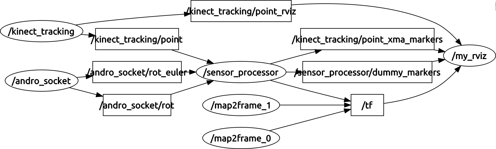
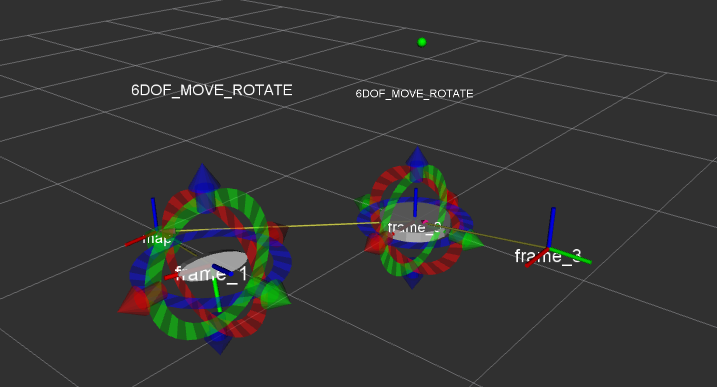
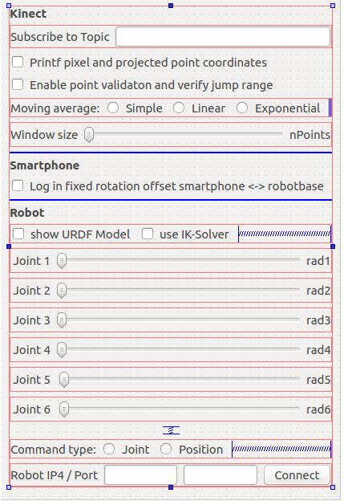

### dotnect_stack

#### About
The metapackage includes 3 nodes named dotnect_dgram_socket, kinect_tracking and sensor_processor. The first listens on a multicast socket and pushes the data depending on the sensor to a ROS-topic. The second one subscribes to an Image topic of type *sensor_msgs::Image* and tracks via *Minimum Entry Search* the closest point inside the depth matrix. The points coordinates including a Rviz marker are then published.
The sensor_processor averages the output of the previous topics and pushs them to topic for Rviz again or parses with a user specific template to a text file.

Furthermore the node rviz markers and coordinate transforms are output to see where the tracked point goes.     

 
 

#### Install
Clone the package into your workspace directory `catkin_ws/src` . If the workspace is non existent, follow this [link](http://wiki.ros.org/catkin/Tutorials/create_a_workspace).
You can use any depth camera with this package as long as it provides an Image topic of type *sensor_msgs::Image*.  
Launch it via `roslaunch dotnect_launch dotnect.launch`  

Change the calibration data according to your calibration results, merge them into the [yaml-file](install/depth_yourSerial.yaml) with your custom name *depth\<serial number>*. Place it in the directory */home/<user>/.ros/camera_info*. The parameters dont differ too much, so they could be reused for other Kinectv1.

Workspace is developed with * kinetic (1.12.2) * (earlier versions not tested)

###### Code style
The code style is consistent with the [ROS style guide](http://wiki.ros.org/CppStyleGuide). With [clang-format](https://github.com/davetcoleman/roscpp_code_format): 
`find . -name '*.h' -or -name '*.hpp' -or -name '*.cpp' | xargs clang-format -i -style=file $1`

###### Presetup scripts for use with Kinectv1 (Xbox 360)
The scripts are a convenience thing to pull driver and ros-package for the kinectv1 and get you started right away. Run them inside their *install* folder via `sudo ./3party.sh` and `sudo ./2party.sh`. (Make sure to have the box ticked off for *executing file as program*)  
For the kinectv2 (One) use [this](https://github.com/OpenKinect/libfreenect2) driver and [that](https://github.com/code-iai/iai_kinect2) ros-package.  

###### Preview
After implementing the IK-solver for a generalized URDF-model, all main controls will be brought into RViz with a major GUI to ease steering. Adjusting the parameters real-time results in new opportunities to optimize parameters and test algorithms.

---

Licensed under http://opensource.org/licenses/BSD-3-Clause  
copyright: 2015 - 2016 Copyright (c) 2016 14U2g4ocMy5aB2cY4cmCtbXD6qyNQzujuA
All rights reserved
